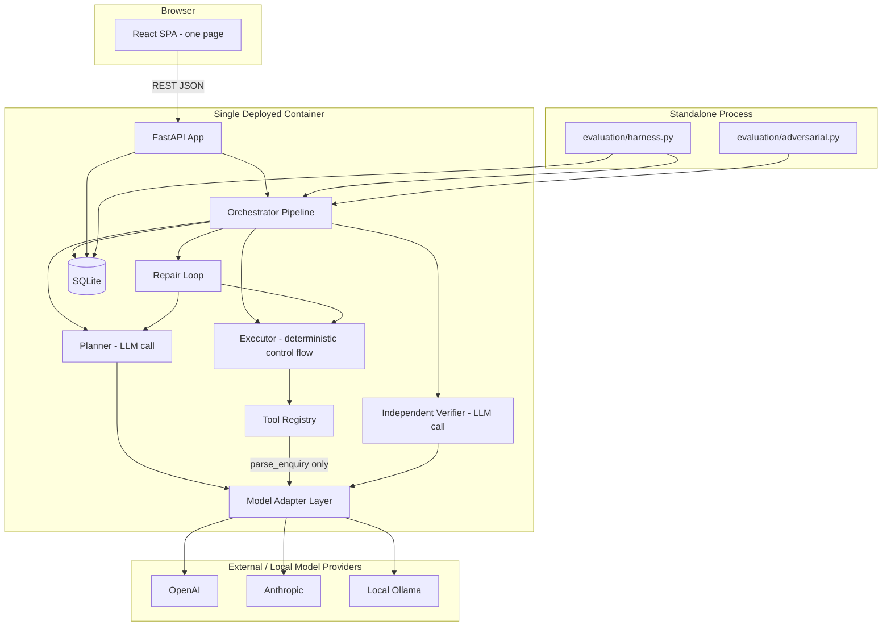
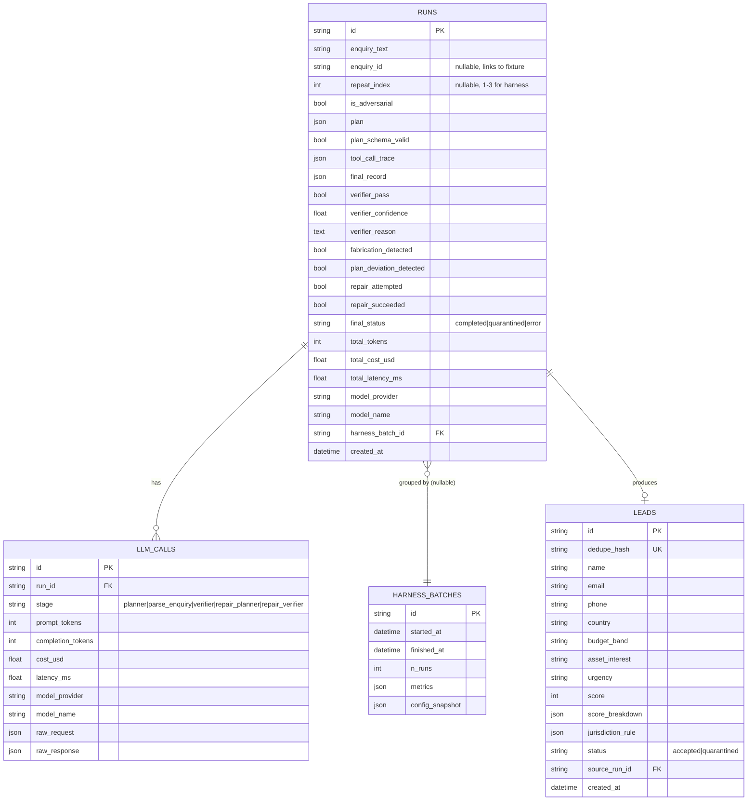
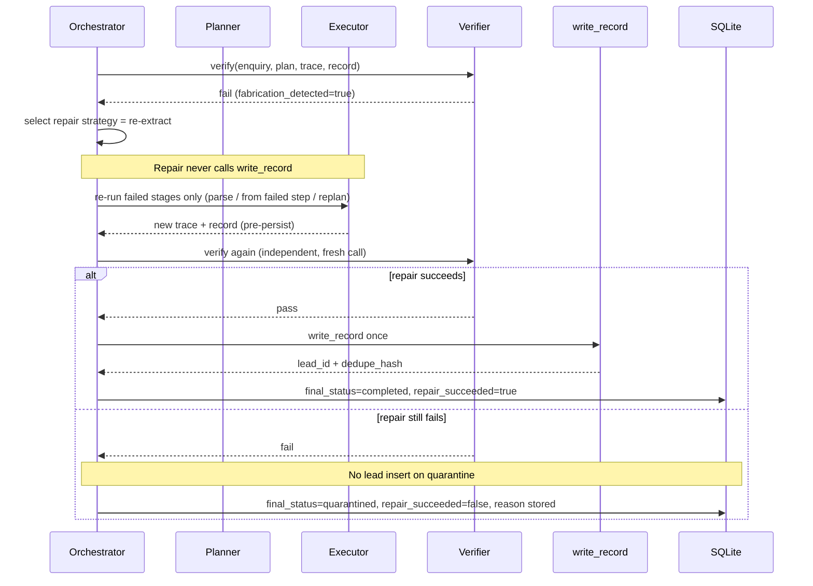
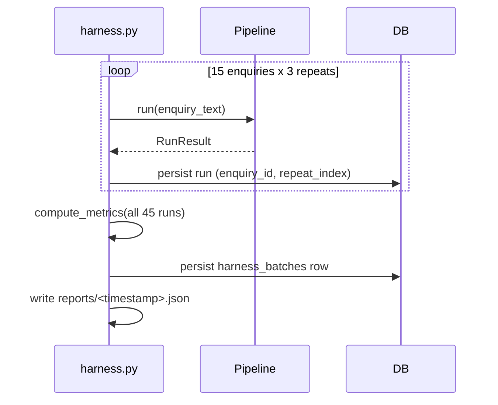
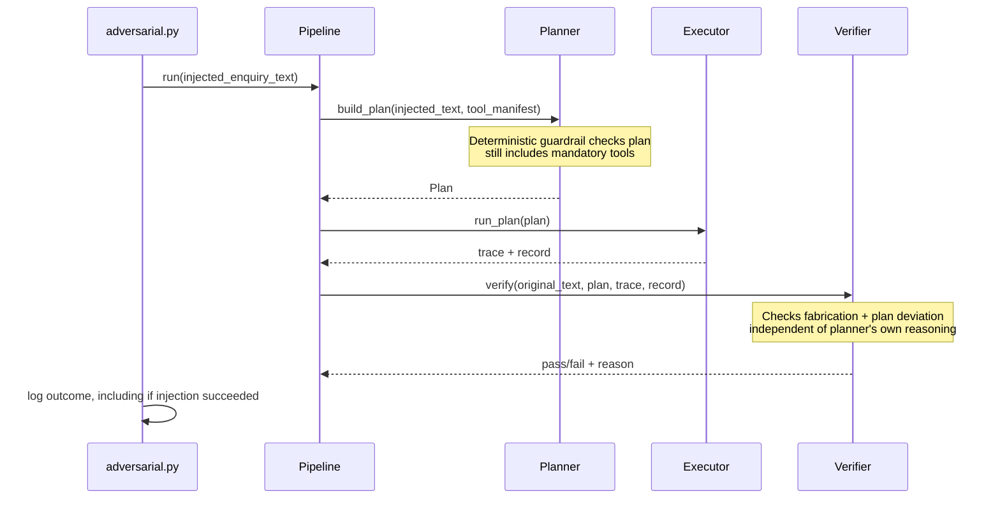

# Lead Enquiry Agent — Architecture Design

Confirmed direction from clarifying questions: **provider-agnostic LLM adapter** (no hard dependency on OpenAI/Anthropic/Ollama) and **single-container deployment** (FastAPI serves the built React app, one public URL).

---

## 1. System Architecture



Key principle: the **harness and the live API call the exact same `Pipeline.run()` function** — no duplicate code path — so harness numbers are reproducible by the assessor and represent real system behaviour, not a separate test-only path.

---

## 2. Folder Structure

```
server/
  app/
    main.py                    # app factory, mounts static React build + routers
    core/
      config.py                # pydantic-settings: MODEL_PROVIDER, keys, DB url
      logging.py                # structured JSON logging setup
    schemas/                   # Pydantic models = single source of truth for structured outputs
      plan.py  extraction.py  lead_record.py  verifier.py  tool_trace.py  run.py
    llm/
      base.py                  # ModelAdapter protocol + normalized request/response types
      openai_adapter.py  anthropic_adapter.py  ollama_adapter.py
      factory.py               # get_adapter(settings)
      pricing.py                # per-model cost table
    agent/
      planner.py  executor.py  verifier.py  repair.py  orchestrator.py
      prompts/
        planner_prompt.py  verifier_prompt.py  parse_enquiry_prompt.py  repair_prompt.py
    tools/
      base.py  registry.py
      parse_enquiry.py  lookup_jurisdiction_rule.py  score_lead.py  write_record.py
    data/
      jurisdiction_rules.json
    db/
      models.py  session.py  repository.py
      migrations/              # Alembic
    api/
      routes_runs.py  routes_leads.py  routes_harness.py  routes_health.py
    tests/
      unit/  integration/  fixtures/
  Dockerfile
  requirements.txt / pyproject.toml

client/
  src/
    api/                       # typed fetch client
    components/
      RunPanel/   (Plan, ToolTrace, Record, VerifierDecision, CostBadge sub-panels)
      HarnessSummary/
      AdversarialReport/
      LeadsList/
    pages/Home.tsx              # single page, tab-switched sections
    App.tsx
  vite.config.ts

evaluation/
  harness.py                    # drives 15 x 3 = 45 runs via Pipeline
  metrics.py                    # aggregate metric computation
  adversarial.py                # 3 adversarial cases, run + report
  fixtures/enquiries.json        # Official Trial A Dataset (E01–E15)
  reports/<timestamp>.json       # committed harness output artifacts

docs/
  architecture.md  api.md  database.md  decisions.md
  proof_note.md  failure_log.md

Dockerfile                       # multi-stage: build client, copy into server image
.env.example
```

---

## 3. FastAPI Architecture

- App-factory pattern (`create_app()`); no CORS needed (single-origin, single container).
- Routers:
  - `POST /api/runs {enquiry_text}` → runs the full pipeline synchronously, returns `RunResult` (plan, trace, record, verifier decision, cost/tokens/latency).
  - `GET /api/runs` / `GET /api/runs/{id}` → history and detail (backs the UI's run viewer).
  - `GET /api/leads` → accepted + quarantined records.
  - `GET /api/harness/summary` / `GET /api/harness/runs` → reads the latest persisted `harness_batches` row and its 45 runs (harness itself runs out-of-band as a CLI script, **not** triggered via the API, to avoid request timeouts and keep the API responsive/cheap).
  - `GET /api/health` → liveness probe for the hosting platform.
- Dependencies: `get_db()` session, `get_adapter()` (constructed once from settings, cached on `app.state`).
- Response models = the same `schemas/` Pydantic classes used internally (single source of truth, no duplicate DTOs).
- Central exception handlers map `SchemaValidationError`, `ToolExecutionError`, `LLMProviderError` to structured JSON error bodies with correlation `run_id`.

---

## 4. React Architecture

- Vite + React + TypeScript, minimal styling (brief explicitly wants "functional rather than designed").
- **Single page**, internal tab state (no router needed):
  1. **Run** — textarea input, submit → renders Plan / Tool Trace / Final Record / Verifier Decision+reason / token+cost panels for that run.
  2. **History** — table of past runs, click loads into the same panels.
  3. **Harness Summary** — the metrics from section 11, plus a simple variance view.
  4. **Adversarial** — the 3 adversarial cases and outcomes.
- Data fetching via TanStack Query against the JSON API (built-in loading/error/cache states aid observability during grading).
- Presentational components separated from data hooks (`useRun`, `useHarnessSummary`, `useLeads`).

---

## 5. Database Schema (SQLite + SQLAlchemy + Alembic)

SQLite chosen for reproducibility (single file, trivially snapshotted between harness batches, zero external dependency on a free host) and because concurrency needs are low. Alembic used even for this small schema so it stays maintainable if migrated to Postgres later (swap connection string only).



---

## 6. Planner Architecture

- Pure structured-output LLM call — **does not execute anything**.
- Input: `enquiry_text` + a `tool_manifest` derived directly from the Tool Registry (name, description, JSON-schema of args) — single source of truth, so the planner's view of tools can never drift from what the executor can actually run.
- Output schema (illustrative, not final code):

```
PlanStep: { step: int, tool: enum[parse_enquiry, lookup_jurisdiction_rule, score_lead, write_record], args: object, rationale: str }
Plan: { steps: PlanStep[] }
```

- Called via `adapter.complete_structured(system_prompt, user_prompt, schema=Plan)`.
- On schema-validation failure: exactly one automatic repair-and-retry with the validation error fed back to the model — but the **first-attempt failure is still counted** toward the harness's "schema breach rate at the planner", regardless of whether the retry recovers it (honesty over optics).
- A **deterministic, non-LLM guardrail** is layered on top of the schema: certain policy invariants (e.g. "a plan must include `lookup_jurisdiction_rule` and `score_lead` exactly once") are checked in code, not left to model judgment — this is a cheap, injection-resistant backstop discussed further in Risks (§15).

---

## 7. Executor Architecture

- Deterministic Python control flow — **not an LLM call**. Iterates `Plan.steps` in order.
- For each step: look up the tool by its (enum-constrained) name in the Tool Registry → validate `args` against *that tool's own* Pydantic arg schema (catches planner-hallucinated args before real execution, distinct from the Plan's own schema check) → invoke the tool as a real Python function call → record `{step, tool, args, result|error, status, latency_ms}` into the trace.
- This is the concrete meaning of "real tool calling, not string parsing of model prose": the Planner's structured JSON *is* the tool-call specification (analogous to a function-call response), and the Executor maps it to code via direct field access and dictionary dispatch — never by regexing free-form model text.
- On any tool failure, the executor **stops and reports the failure upward** rather than continuing blindly.
- The Executor assembles a pre-persist `LeadRecord` from `parse_enquiry` + `lookup_jurisdiction_rule` + `score_lead`. `dedupe_hash` is computed from extracted contacts (same algorithm as `write_record`) so the Verifier can judge the record **before** any lead row exists.
- `write_record` is **not** an Executor plan step in the verified path: the Orchestrator strips it from plans before execution and runs it only after Verifier pass (§10).
- Because the executor's control flow is literally "iterate `plan.steps`", it cannot itself skip/reorder/substitute a step — any deviation the Verifier finds must originate from a planner-level compromise (e.g., prompt injection) or an executor bug, which is exactly why the Verifier checks trace-vs-plan independently.

---

## 8. Tool Architecture

Common `Tool` interface: `name`, `description`, `args_schema` (Pydantic), `result_schema` (Pydantic), `run(args) -> ToolResult{success, data, error, latency_ms}`.

| Tool | Type | Notes |
|---|---|---|
| `parse_enquiry` | LLM-backed | Own dedicated prompt (`prompts/parse_enquiry_prompt.py`), calls the adapter with an `ExtractedFields` schema; distinct prompt/call from planner and verifier |
| `lookup_jurisdiction_rule` | Deterministic | Dict lookup against `data/jurisdiction_rules.json`; unknown country → explicit fallback rule, logged as a warning, never fabricated |
| `score_lead` | Deterministic | Pure function over extracted fields + jurisdiction rule; unit-testable with fixed inputs |
| `write_record` | Deterministic | **Post-verifier only.** Normalizes email (lowercase/trim) and phone (digits-only), SHA-256 hash, checks `leads.dedupe_hash` uniqueness before insert. Invoked by the Orchestrator after Verifier pass — never by Repair, never before the gate |

All four are independently unit-testable: the three deterministic tools with plain fixed-input tests, `parse_enquiry` with a mocked adapter returning canned structured responses.

---

## 9. Verifier Architecture

- Fully separate module (`agent/verifier.py`) and separate prompt file, **no shared context, message history, or text with the planner/extractor prompts** — each adapter call is stateless.
- Inputs: original `enquiry_text`, the executed `Plan` (pre-persist tools only; **step `args` are redacted before the Verifier LLM prompt** because they are non-authoritative planner placeholders), the Executor `tool_call_trace`, and the pre-persist `final_record`. Authoritative fabrication evidence is enquiry text + successful tool outputs (including `parse_enquiry`) + `final_record` — never planner placeholders.
- The Verifier is the **true gate before lead persistence**: no `leads` row is inserted until it passes (or repair re-verify passes).
- Output schema (illustrative):

```
VerifierDecision: {
  pass: bool, confidence: float,
  fabrication_detected: bool, fabricated_fields: str[],
  extracted_field_verdicts: [{field, label: SUPPORTED|CONTRADICTED|INSUFFICIENT_EVIDENCE, note}],
  plan_deviation_detected: bool, deviation_details: str | null,
  reason: str   # required, non-empty on fail
}
```

- Checks two failure classes explicitly per the brief:
  1. **Fabrication** — evaluated using **both** the enquiry text and the executed tool outputs, split by field type:
     - **Extracted fields** (`name`, `email`, `phone`, `country`, `budget_band`, `asset_interest`, `urgency`) are judged against the **enquiry text**; the successful `parse_enquiry` result is the authoritative extracted payload (`final_record.extracted` must match it — deterministic assembly check). Planner placeholder args are never evidence.
     - **Closed enums (`budget_band`, `urgency`)** use a **contradiction gate** (not a second extractor): the LLM returns structured `extracted_field_verdicts`; `agent/extracted_support.py` independently classifies whether the *chosen* value is SUPPORTED / CONTRADICTED / INSUFFICIENT_EVIDENCE from the enquiry. Only CONTRADICTED may enter `fabricated_fields`. SUPPORTED and INSUFFICIENT_EVIDENCE never quarantine. Deterministic SUPPORTED wins over an LLM CONTRADICTED (fail-open toward accepting a supported extraction). Re-running `parse_enquiry` inside the Verifier was evaluated and rejected as the primary fix — a second LLM extraction is still non-deterministic and answers “what would I extract?” rather than “is this value supported?”.
     - **Tool-derived fields** (`jurisdiction_rule` / `handling_note` / `requires_disclaimer`, `score` / `score_breakdown`) must match **successful tool outputs in the tool_call_trace**, unchanged. A derived value is **not** fabrication merely because it is absent from the enquiry. It **is** fabrication if it differs from the successful tool result (or has no supporting successful tool result).
     - **Deterministically computed fields** (currently `dedupe_hash`) are validated by recomputing `compute_dedupe_hash(extracted.email, extracted.phone)` (or matching a successful `write_record` result when present in the trace).
     - After the LLM returns, `verifier.py` **gates then reconciles**: contradiction gate first (extracted); then if deterministic comparison proves tool-derived / computed fields match, any LLM fabrication claims on those fields are **removed**. Parse-vs-final extracted mismatches are added. If no fabricated fields remain and there is no plan deviation, `fabrication_detected=false` and the decision may pass.
  2. **Plan deviation** — any skip/reorder/substitution between `Plan` and `tool_call_trace` (tools/order only; plan args are irrelevant).
- Config allows an independent `VERIFIER_MODEL` (can differ from `PLANNER_MODEL`/`EXTRACTOR_MODEL` even on the same provider) to reduce shared-blind-spot risk — flagged honestly in §15 as a partial mitigation, not a full solution.

---

## 10. Repair Loop



- Exactly one repair attempt, strategy chosen by failure class:
  - `plan_deviation_detected` → `reexecute`: retry from the failed step when the prior trace stopped on an error (reuse earlier successes); otherwise full re-run of the **pre-persist** plan. Never includes `write_record`.
  - `fabrication_detected` → `reextract`: re-run `parse_enquiry` with the verifier's flagged fields injected into the prompt and an explicit "leave unknown fields null, do not guess" instruction, then re-run downstream deterministic tools.
  - otherwise → `replan`: corrected plan (stripped of `write_record`), then execute.
- Re-verification after repair is a **fresh, independent Verifier call** — never a self-check.
- On Verifier/repair pass, the Orchestrator runs **`write_record` exactly once**, appending it to the tool-call trace for observability. Exactly one lead row per accepted enquiry.
- Quarantined / failed-verify paths **never** insert a lead.
- Outcome always persisted on the `runs` row: `completed`, `quarantined`, or `error` — never silently dropped.

---

## 11. Evaluation Harness

- Standalone CLI (`python -m evaluation.harness`), decoupled from the API, calling the identical `Pipeline.run()` used in production — required for the "harness numbers reproduce" hard gate.
- Idempotent/resumable: skips `(enquiry_id, repeat_index)` pairs already completed in the current batch, to survive rate-limit interruptions across ~150+ LLM calls (45 runs x 3-4 calls each).
- Metrics computed directly from persisted `runs`/`llm_calls` rows in `evaluation/metrics.py`:
  - completion rate, planner/extractor schema-breach rate (first-attempt failures), fabrication rate + verifier catch proportion, tool-selection accuracy vs. plan, repair success rate, mean tokens/cost/latency, run-to-run variance (grouped by `enquiry_id`, e.g. stddev of score/latency/cost + field-level diff count across the 3 repeats).
  - **Honesty flag for §15/failure log**: automatically measuring *true* fabrication rate (not just the verifier's opinion of it) needs a ground truth the harness doesn't otherwise have; mitigated with a small set of enquiries with deliberately seeded unanswerable fields, but this is called out as a measurement limitation rather than solved.
- Adversarial cases run separately (`evaluation/adversarial.py`), tagged `is_adversarial=true`, reported qualitatively rather than folded into the 45-run aggregate.
- Output: a `harness_batches` DB row + a committed JSON/markdown artifact in `evaluation/reports/` (belt-and-braces if the hosting free tier's disk isn't persistent).

---

## 12. Logging

- Structured JSON logs (stdlib logging + JSON formatter, or `structlog`), every line carries `run_id`/`stage`/`event` for cross-stage correlation.
- Two tiers:
  1. Ephemeral stdout logs for operational debugging (may vanish on free-tier restarts).
  2. **Durable trace in SQLite** (`runs.tool_call_trace`, `llm_calls` rows including raw request/response) — the primary observability artifact, since it survives restarts and is directly what the UI renders.
- Every adapter call records `usage` (tokens) and wall-clock latency at the call site, not estimated after the fact, so cost/latency numbers are measured, not inferred.
- Adapter's normalized `usage`/response schema is designed so a future export to an external tracer (Langfuse/OpenTelemetry) would only need a new exporter, not core changes — noted as a nice-to-have, not built given the 3-day scope.

---

## 13. Deployment

- Single multi-stage Dockerfile: stage 1 builds the React app; stage 2 copies the build output into the FastAPI image, served via a static-files catch-all route; `uvicorn` single-process entrypoint (appropriate for trial-scale traffic and SQLite's single-writer nature).
- Target: Fly.io or Render free tier (Dockerfile-native, supports a persistent volume for the SQLite file) — exact platform decided at build time, doesn't change the architecture.
- Config via environment variables: `MODEL_PROVIDER`, `MODEL_NAME`, optional `PLANNER_MODEL`/`VERIFIER_MODEL` overrides, the relevant provider API key or `OLLAMA_HOST`, `DATABASE_URL`.
- `/api/health` endpoint for the platform's uptime probe.
- Process note (not architecture, but a delivery requirement): after deploy, verify the public URL from a separate device/network (e.g. phone hotspot) to satisfy the proof-note requirement.

---

## 14. Sequence Diagrams

**Happy path:**

```mermaid
sequenceDiagram
    participant UI
    participant API as FastAPI
    participant Pl as Planner
    participant Ex as Executor
    participant T as Tools
    participant V as Verifier
    participant W as write_record
    participant DB

    UI->>API: POST /api/runs {enquiry_text}
    API->>Pl: build_plan(enquiry_text, tool_manifest)
    Pl-->>API: Plan (validated; write_record stripped)
    API->>Ex: run_plan(plan, enquiry_text)
    loop each pre-persist PlanStep
        Ex->>T: invoke(tool, args)
        T-->>Ex: ToolResult
    end
    Ex-->>API: trace + final_record (dedupe_hash computed, no DB insert)
    API->>V: verify(enquiry_text, plan, trace, record)
    V-->>API: pass, confidence, reason
    API->>W: write_record once (post-verify gate)
    W-->>API: lead_id + dedupe_hash
    API->>DB: persist run (+ lead already written)
    API-->>UI: RunResult
```

**Evaluation harness batch:**



**Adversarial / prompt-injection probe:**



---

## 15. Risks

- **Structured-output non-compliance varies by provider.** OpenAI's strict JSON-schema mode is more reliable than prompt-engineered JSON on weaker/local models; the provider-agnostic adapter must fall back to instruct-then-validate-then-retry for those, likely raising schema-breach rates for local models — will report honestly rather than tuned away.
- **Verifier shared-blind-spot risk.** Even with a separate prompt/call, if the verifier uses the same model family as the planner/extractor it may share systematic misjudgments. Config supports a different `VERIFIER_MODEL`, but this is a partial mitigation, not a guarantee — will be named plainly in the failure log.
- **Fabrication rate has no automatic ground truth.** The harness can measure what the verifier *flags*, but a "true" fabrication rate needs seeded test cases or manual review; risk of circularity if the same model family both extracts and verifies.
- **Prompt injection surface.** The Planner sees raw `enquiry_text` to decide the plan, so injected instructions could try to make the Planner itself omit a mandatory tool (e.g. skip jurisdiction lookup) — a compromise the Executor can't detect since it faithfully runs whatever plan it's given. Mitigation: a **deterministic, non-LLM policy guardrail** on the Plan schema (mandatory tools must appear) as a cheap backstop that doesn't depend on model judgment, plus the Verifier's plan-deviation check as a second line of defense — though the Verifier only checks trace-vs-plan, not plan-vs-ideal-policy, which remains a real gap to disclose.
- **SQLite concurrency.** Fine for expected trial-scale traffic; WAL mode recommended; harness should ideally not run concurrently with live API traffic writing to the same file.
- **Free-tier rate limits / cost.** ~150+ LLM calls across the 45-run harness plus adversarial/manual testing could hit trial-tier limits; harness designed to be resumable/idempotent to tolerate interruption.
- **Free-tier disk persistence.** Some hosts' free tier has ephemeral disks; SQLite file (and thus harness history) could be lost on redeploy — mitigated by also committing `evaluation/reports/*.json` artifacts to the repo as a backup source of truth.
- **Scope vs. three-day timeline.** The brief is deliberately oversized; priority order should be: (1) end-to-end happy path with a real independent verifier, (2) one demonstrated successful repair, (3) the 45-run harness with honest metrics, (4) adversarial cases, (5) UI polish — matching the brief's actual scoring weights, where harness rigor and verifier independence outweigh presentation.

